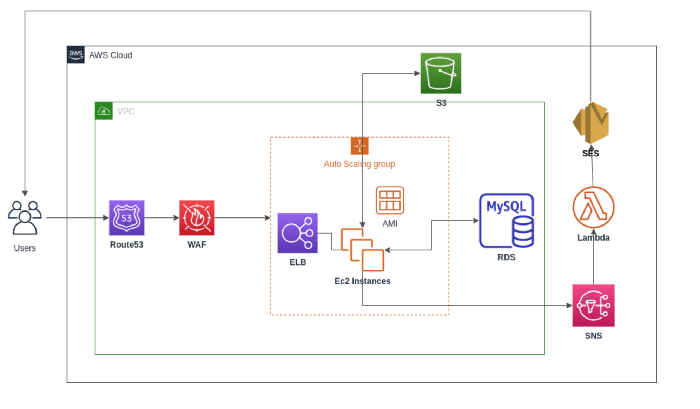
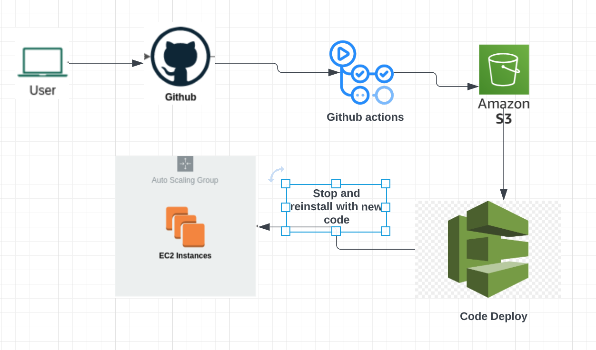
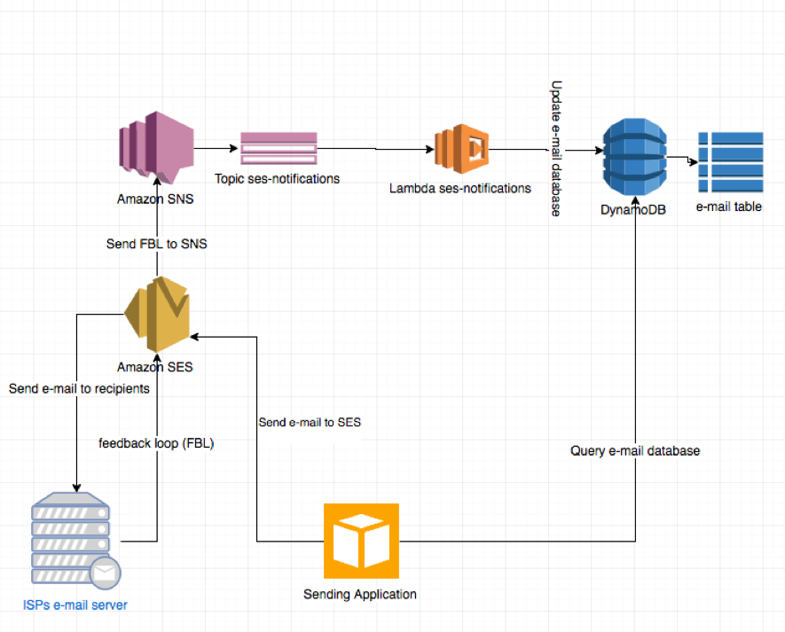

# AWS-Backend-Infrastructure-Project
This repo contains the information about a project on AWS with 3 sub repos. The project involves a SpringBoot web application with automated CI/CD and AMI creation using HCL packer. The cloud infrastructure is done using cloud formation template and the server less components  are created using AWS Lambda functions.

# Block diagram

The below diagram is an overview of the system built in this project. This is done using infrastructure as a code concept and is configured in a cloud formation yaml file.

[Repo for the infrastructure](https://github.com/ebiskhan123/infrastructure)

 

 

The below diagram is an overview of the system's CI/CD workflow. The backend application is built on Spring Boot and has github workflows and AWS code deploy to perform continuous integration and continuous deployment respectively.

[Repo for the web application](https://github.com/ebiskhan123/webservice)

 

 

The below diagram is an overview of the serverless code. The serverless functionality to send emails is achieved using AWS lambda functions.

[Repo for the lambda function](https://github.com/ebiskhan123/serverless)

 

